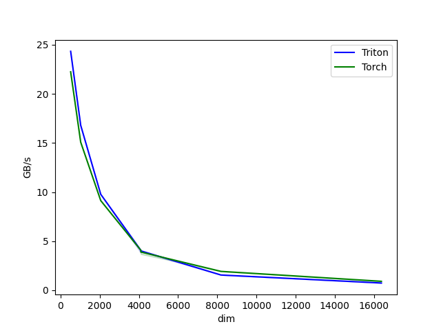

# Accelerating SwiGLU with Custom Triton Kernel Fusion
* Context: SwiGLU activation in large model training/inference suffers from significant I/O overhead. 
* Challenge: Improve computation speed of the Feed Forward Layer (FFD) by reducing intermediate memory traffic. 
* Solution: Developed a custom fused Triton kernel to merge multiple operations, minimizing I/O and improving execution efficiency. 
* Result: Achieved 30% speedup at dim=8192, accelerating both forward and backward passes.

