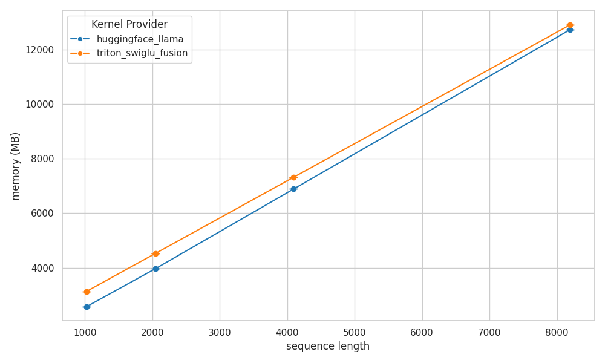
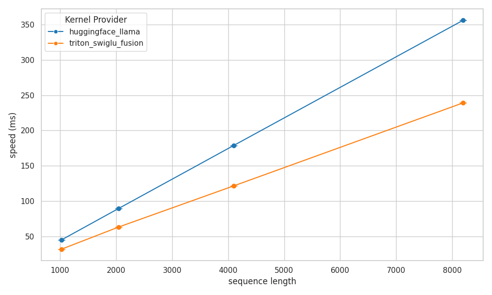
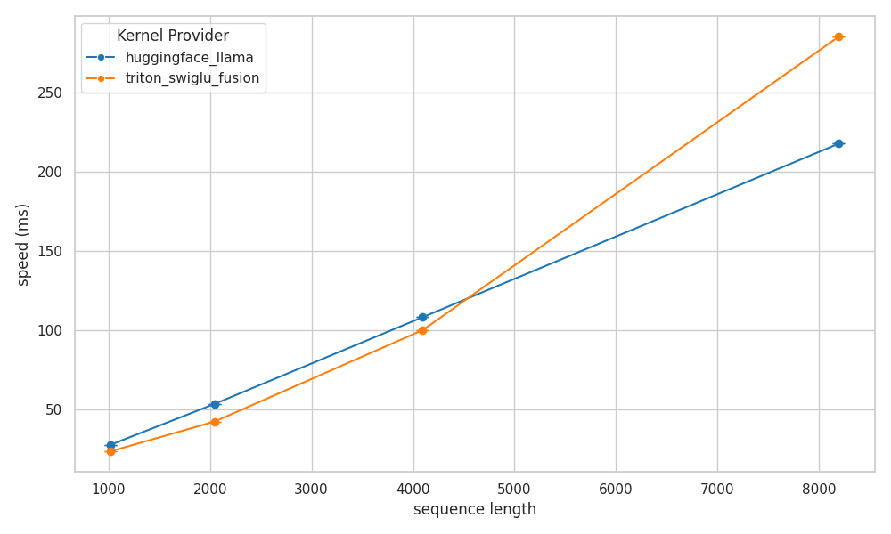

# Reduce SwiGLU Peak Memory via Triton Kernel Fusion 
In LLMs, the Feed-Forward Network (FFN), a core component of each Transformer block, typically comprises the majority of model parameters—often 50–60% or more. During training, FFN activation memory scales linearly with sequence length, making it an important target for memory optimization.

* **Challenge**: The challenge is to further optimize memory usage for SwiGLU layers while maintaining training and inference speed, leveraging the optimized kernels already provided by PyTorch.
  
* **Solution**: Use Triton to implement a fused SwiGLU kernel that optimizes activation memory usage, specifically by reducing the intermediate activations stored during the forward pass for backpropagation and performing in-place parameter updates.

* **Benchmark**: Reduced memory usage by **32%** at sequence length 16,000, maintaining forward speed and improving backward speed by **3.3%**. 

  
  
 Figure 1: Peak memory reduction for SwiGLU using Triton kernel fusion. 

  
  
 Figure 2: SwiGLU backward computation speed increased by 3.3%. 

  
  
 Figure 3: SwiGLU forward computation speed remained unchanged. 

